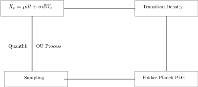

# FokkerPlanck-Transformer

Transformer for solving the problem in `Stochastic Local Volatility`
* Basic Component
  * All the files can be found [here](https://drive.google.com/drive/folders/1tUCTlFCo_-FoiCj-LkJdOsZrlSSq4mTe?usp=sharing)
  * [Online SDE optimization simulation](https://drive.google.com/file/d/1QRuUF7aWUdJ25q0jIrGUu63Mn1ohrIMp/view)
* Stages of the lab
  * Lab_0, sampling of the FokkerPlanck PDE, with the help of Quantlib.
  * Lab_1, FNO in solving the FokkerPlanck PDE.
  * Lab_2, FNO Transformer in solving the FokkerPlanck PDE.

* Basic Introduction
  * Mid-May UBS Tour
  * Normally, it would be a high dimensional problem if the pde dimension is over 4 and almost can not be solved if the dimension is over 7.
  * There are also some RL based methods to solve it
    * In solving `HJB PDE`, [Actor-Critic Method for High Dimensional Static Hamilton-Jacobi-Bellman Partial Differential Equations based on Neural Networks](https://drive.google.com/file/d/1HaaCSM7JVOiG9VpH0m72fsYW_urPEwsb/view?usp=sharing)   
    * In solving `Elliptic PDE`, [Neural Q-learning for solving elliptic PDEs](https://drive.google.com/file/d/1rh6Syg8r4UgnDKIBX7bOw2zkC_4DDMF6/view?usp=sharing)

## Week3

* Problems remian in this week
  * Only a set of PDEs are suitable for Fourier Transform.
  * Why sample is `256*256` and downsample is `64*64`, what has downsampling done here?
  * How MCMC using FNO？
  * To solve different PDEs, do we need to change the code in the FNO?
    * Or the info has been included in the dataset by sampling.
  * We need to solve a two dimensional difussion equation.
    * https://github.com/KangOxford/Fourier-Transformer/blob/6fd306e6a6856a46b3db78fa57db8ced3c307060/fourier_neural_operator/fourier_3d.py#L1-L7
    * In the `class SpectralConv3d(nn.Module):`
     https://github.com/KangOxford/Fourier-Transformer/blob/90686ea11466e55739068a4ca5b56fa74063d6f5/fourier_neural_operator/fourier_3d.py#L61-L76
  * How does the advantage of operator learning functions in this lab?
    * Does it not need to train again with different intial condition or boundrary condition.
    * Perhaps. As the Operator is learnt. So one of the three condtion has been solved, with the other two to be the intial condition and boundrary condition.
* Try with FNO for basic set up of the experiment.
* The FNO model for solving entire family of PDEs.
  * [FNO project](https://zongyi-li.github.io/neural-operator/)
  * [FNO GitHub](https://github.com/zongyi-li/fourier_neural_operator)
  * [FNO introduction](https://zongyi-li.github.io/blog/2020/fourier-pde/)
  * [FNO data](https://drive.google.com/drive/folders/1LfmrsIw6Wo_vbYhy3Azr4KVK8FeZDLT8?usp=sharing) 
  * [FNO models](https://drive.google.com/drive/folders/1pxQeQhE-M9OGbVIHr35fid4CDquXFWa-?usp=sharing)
    * Here are the pre-trained models. It can be evaluated using eval.py or super_resolution.py
* By now there is no need to focus on the Galerkin Transformer, as it only provides a better precision on results.
* We will focus more on the FNO in the next stages.
* The FNO is more focused on solving a family of PDEs without try to train the neural network from the scratch, such as when the initial condition or the boundary condition change.
